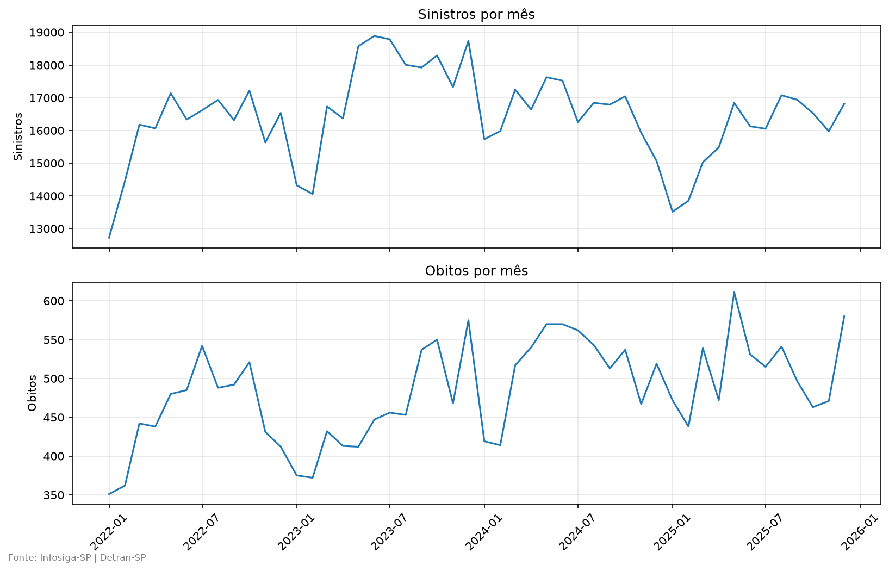
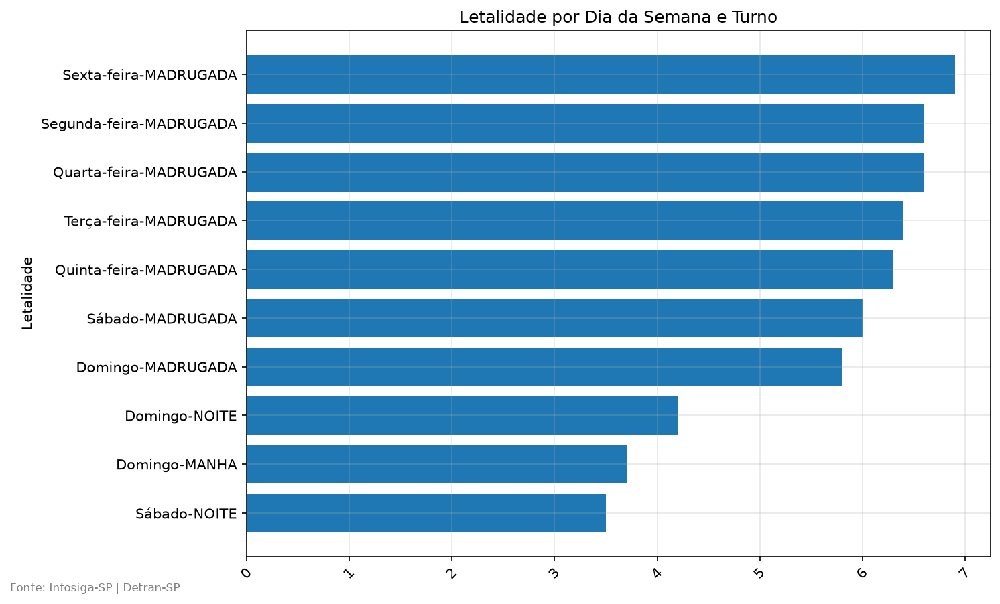
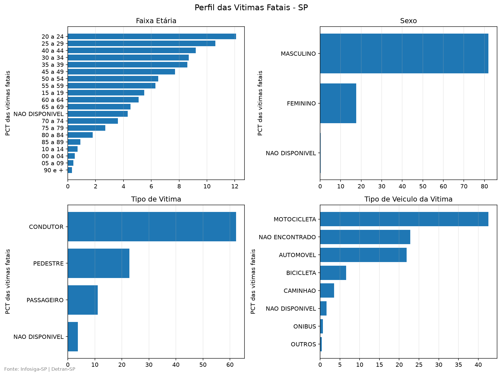
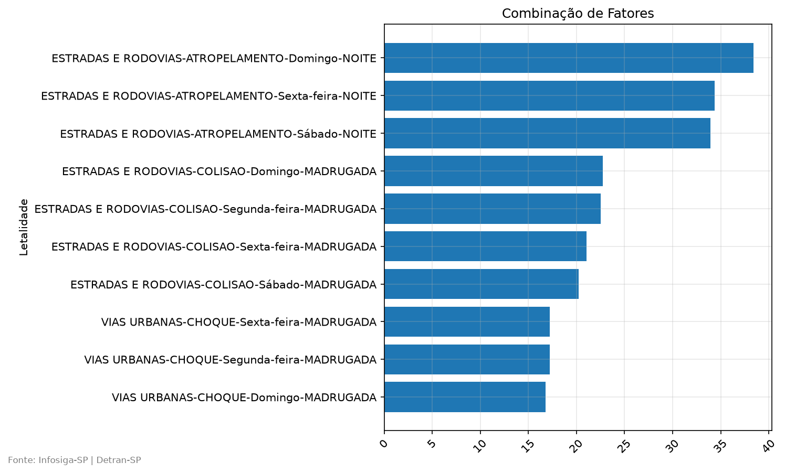

# Quem morre no trânsito de SP, onde e quando?

Análise dos sinistros de trânsito do estado de São Paulo (2022–2025) com os
dados abertos do Infosiga-SP (Detran-SP), para identificar onde e quando uma
ação de segurança viária teria mais efeito.

## Principais achados
1. Entre 2022 e 2025, os sinistros ficaram estáveis (−0,3% ao ano), mas os óbitos
cresceram em média 4% ao ano: a letalidade subiu de 2,83 para 3,22 mortes por 100 sinistros.
2. A combinação de fatores mais letal é o atropelamento em estradas e rodovias no
domingo à noite: 38,4 óbitos a cada 100 sinistros. As três combinações mais letais
são todas atropelamentos em rodovias, à noite, entre sexta e domingo.
3. Perfil das vítimas fatais: 82,0% são homens, 62,1% eram condutores e 41,9%
estavam em motocicletas. A faixa de 20 a 24 anos concentra 12,2% das mortes.
O grupo mais atingido é o de condutores de motocicleta, com 37,0% de todas as mortes.

## Perguntas
1. Como evoluem sinistros e mortes por mês? Existe sazonalidade?
- **Resposta:**
  Sazonalidade fraca, tendência forte. O mês com menos óbitos foi janeiro ou
  fevereiro em todos os anos, e o mês com menos sinistros foi janeiro ou fevereiro
  em 3 dos 4 anos (em 2024 foi dezembro). Não há picos sazonais que se repitam.
  O achado mais importante é a tendência: enquanto os sinistros ficaram estáveis
  (−0,3% ao ano), os óbitos cresceram 4% ao ano, e a letalidade subiu de 2,83 (2022)
  para 3,22 (2025) mortes a cada 100 sinistros. O número de acidentes não
  aumentou, mas eles passaram a ser mais fatais.

  | Ano | Sinistros | Óbitos | Óbitos a cada 100 sinistros |
  |---|---|---|---|
  | 2022 | 192.156 | 5.444 | 2,83 |
  | 2023 | 208.034 | 5.490 | 2,64 |
  | 2024 | 198.688 | 6.171 | 3,11 |
  | 2025 | 190.244 | 6.129 | 3,22 |

  **Gráfico:**

<p align="center">
  
</p>

2. Quais municípios concentram mais mortes?
  - **Resposta:**
  Em números absolutos, São Paulo (3.888 óbitos), Guarulhos (627) e Campinas (602)
  concentram mais mortes. Mas, entre os municípios com pelo menos 1.000 sinistros,
  os mais letais são cidades menores do interior e do litoral:<br>
  IBIUNA com 1.103 sinistros, desses, 68 óbitos; 6,2 óbitos a cada 100 sinistros.<br>
  ITANHAEM com 1.653 sinistros, desses, 100 óbitos; 6,0 óbitos a cada 100 sinistros.<br>
  PIEDADE com 1.116 sinistros, desses, 64 óbitos; 5,7 óbitos a cada 100 sinistros.<br>

3. Que dia da semana e turno são mais letais, e não só mais frequentes?
  - **Resposta:**
  A madrugada é o turno mais letal em todos os dias da semana. Os mais letais, em ordem:<br>
  SEXTA-FEIRA | MADRUGADA | SINISTROS 8.580 | MORTES 594 | 6,9 a cada 100<br>
  QUARTA-FEIRA | MADRUGADA | SINISTROS 6.202 | MORTES 408 | 6,6 a cada 100<br>
  SEGUNDA-FEIRA | MADRUGADA | SINISTROS 9.949 | MORTES 658 | 6,6 a cada 100<br>
  **Gráfico:**

  <p align="center">
    
  </p>

4. Qual o perfil das vítimas fatais?
  - **Resposta:**
  Entre as 23.234 vítimas fatais: 82,0% são homens; 62,1% eram condutores, 22,9%
  pedestres e 11,3% passageiros; 41,9% estavam em motocicletas e 22,4% em automóveis.
  A faixa de 20 a 24 anos é a maior (12,2%), seguida de 25 a 29 (10,5%).
  Os percentuais são a fatia de cada grupo no total de mortes, e não a letalidade do grupo.
  **Gráfico:**
  <p align="center">
    
  </p>

5. Que combinação de fatores está associada à maior gravidade?
  - **Resposta:**
  As combinações de fatores mais letais (com pelo menos 500 sinistros) ficaram nesta ordem:<br>
  ESTRADAS E RODOVIAS | ATROPELAMENTO | Domingo | NOITE | sinistros(505) | obitos(194) | 38,42 a cada 100<br>
  ESTRADAS E RODOVIAS | ATROPELAMENTO | Sexta-feira | NOITE | sinistros(556) | obitos(191) | 34,35 a cada 100<br>
  ESTRADAS E RODOVIAS | ATROPELAMENTO | Sábado | NOITE | sinistros(613) | obitos(208) | 33,93 a cada 100<br>
  **Gráfico:**
  <p align="center">
    
  </p>

## Dados
- **Fonte:** [Infosiga-SP](https://infosiga.detran.sp.gov.br/), Detran-SP
  (dados abertos): tabelas de sinistros, pessoas e veículos.
- **Período:** 2022–2025. Os dados de 2015–2018 cobrem só acidentes fatais e
  2026 é ano incompleto, por isso ficaram de fora.
- **Volume após a limpeza:** 789.122 sinistros, 1.029.132 pessoas envolvidas
  (23.234 vítimas fatais) e 893.454 veículos.

## Como foi feito
1. **Leitura (`01_exploracao`):** 6 CSVs em Latin-1, separador `;`,
   empilhados por período com checagem de colunas.
2. **Limpeza (`02_limpeza`):** datas convertidas para `datetime`, 8 colunas
   redundantes de data reduzidas a 2, colunas 100% vazias removidas e as
   três tabelas filtradas para 2022–2025 pela data do sinistro.
   Resultado salvo em Parquet.
3. **Banco (`03_analise_sql`):** as 3 tabelas carregadas num SQLite
   (`infosiga.db`), com contagens validadas.
4. **Análise:** consultas em `sql/consulta.sql` e montagem dos
   gráficos em `notebooks/03_analise_sql`.

## Decisões e limitações
- 76% das vítimas morreram no mesmo dia do sinistro e o restante em até 30
  dias. Por isso as mortes são agrupadas pela data do **sinistro**, e não do
  óbito, para comparar com o número de acidentes no mesmo mês.
- 866 sinistros (todos fatais) não têm hora registrada. Eles foram mantidos
  na base com `data_hora` vazia, para não perder óbitos.
- Nulos (ex.: marca/modelo e cor do veículo) foram mantidos como `NULL`, sem
  preenchimento artificial.
- O campo profissão tem 63,6% de nulos entre as vítimas fatais, por isso foi
  desconsiderado.
- O total de sinistros inclui registros do tipo `NOTIFICACAO`, cuja fatia saltou
  de cerca de 32% (2022–2024) para 46,3% em 2025. Parte da variação da letalidade
  pode vir da mudança na forma de registro, e não só de mudança no trânsito.

## Como reproduzir
```bash
git clone <URL-do-repo>
cd project_sinistros_sp
python -m venv .venv
source .venv/Scripts/activate   # Linux/Mac: source .venv/bin/activate
pip install -r requirements.txt
```
Baixe os dados em infosiga.detran.sp.gov.br e coloque os CSVs em `data/raw/`
com estes nomes:

```
data/raw/
├── pessoas_2022-2024.csv
├── pessoas_2025-2026.csv
├── sinistros_2022-2024.csv
├── sinistros_2025-2026.csv
├── veiculos_2022-2024.csv
└── veiculos_2025-2026.csv
```

Depois rode os notebooks em ordem (`01`, `02`, `03`). A pasta `data/processed/`
é criada automaticamente.
Rode as queries em `sql/consulta.sql` para ver os resultados de cada pergunta.
Os gráficos gerados pelo notebook `03_analise_sql` ficam em `reports/figures`.

## Tecnologias
Python (pandas, matplotlib), SQLite, SQL, Parquet.
